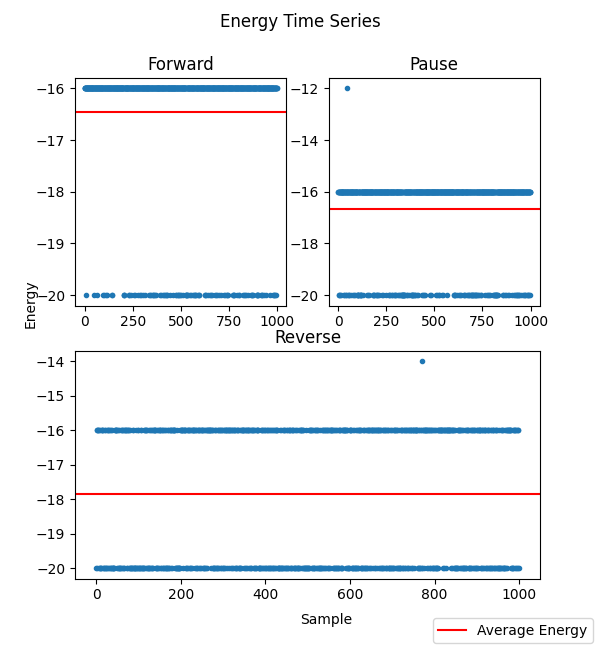

[](
  https://ide.dwavesys.io/#https://github.com/dwave-examples/reverse-annealing-notebook)
[](
  https://circleci.com/gh/dwave-examples/reverse-annealing-notebook)

# Reverse Anneal

This notebook explains and demonstrates the reverse-anneal feature.

Reverse annealing is a technique that makes it possible to refine known good local
solutions, thereby increasing performance for certain applications. It comprises
(1) annealing backward from a known classical state to a mid-anneal state of
quantum superposition, (2) searching for optimum solutions at this mid-anneal
point while in the presence of an increased transverse field (quantum state), and
then (3) proceeding forward to a new classical state at the end of the anneal.

The notebook has the following sections:

1. **The Reverse Anneal Feature** explains the feature and its parameters.
2. **Using the Reverse Anneal Feature** demonstrates the use of the feature on a
   random example problem.
3. **Analysis on a 16-Bit Problem** uses reverse annealing on a known problem and
   compares the results with other anneal methods.
4. **Modulating the Reverse-Annealing Parameters** provides code that lets you
   sweep through various anneal schedules to explore the effect on results.



## Installation

You can run this example
[in the Leap IDE](https://ide.dwavesys.io/#https://github.com/dwave-examples/reverse-annealing-notebook).

Alternatively, install requirements locally (ideally, in a virtual environment):

    pip install -r requirements.txt

## Usage

To enable notebook extensions:

```bash
jupyter contrib nbextension install --sys-prefix
jupyter nbextension enable toc2/main
jupyter nbextension enable exercise/main
jupyter nbextension enable exercise2/main
jupyter nbextension enable python-markdown/main

```

To run the notebook:

```bash
jupyter notebook
```

## License

See [LICENSE](LICENSE.md) file.
